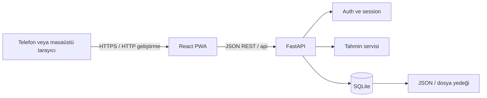

# Mimari ve Ölçeklenebilirlik

## Amaç ve kapsam

Luna şu anda tek kişinin kendi cihazlarında kullanacağı, tek hesaplı ve kendi kendine barındırılan bir uygulama olarak tasarlanmıştır. Mimari bu kapsam için bilinçli şekilde küçüktür: ayrı frontend/backend, dosya tabanlı veritabanı ve sunucu tarafı session.

Bu belge “mevcut kapsamda ölçeklenebilir” ile “çok kullanıcılı SaaS ölçeğinde hazır” ifadelerini birbirinden ayırır.

## Sistem görünümü

Docker kurulumunda Nginx tek dış giriş noktasıdır. Statik React build'ini sunar ve `/api` ile `/health` isteklerini Compose iç ağındaki FastAPI container'ına yönlendirir. Backend portu host makineye açılmaz; SQLite named volume üzerinde kalır.

Frontend hiçbir sağlık verisini kendi kalıcı deposunun ana kaynağı olarak kullanmaz. Kaynak veri SQLite'tır. Service Worker API yanıtlarını önbelleğe almaz.

## Backend modülleri

| Modül | Sorumluluk |
|---|---|
| `main.py` | FastAPI uygulaması, middleware ve HTTP endpoint'leri |
| `database.py` | SQLite bağlantısı ve migration başlangıç noktası |
| `migrations/` | Sürümlü, sıralı ve transaction'lı şema değişiklikleri |
| `schemas.py` | Pydantic istek/yanıt modelleri ve alan doğrulaması |
| `auth.py` | Parola hash'i, session token üretimi ve auth dependency'leri |
| `services.py` | Satır-model dönüşümleri ve döngü tahmin algoritması |

İş kuralları tahmin servisinde, HTTP doğrulaması şemalarda, kimlik doğrulama auth modülünde tutulur. Endpoint sayısı büyürse `main.py` dosyası `routers/auth.py`, `routers/periods.py` ve `routers/insights.py` şeklinde bölünmelidir.

## Frontend modülleri

| Modül | Sorumluluk |
|---|---|
| `App.tsx` | Onboarding, auth durumu, dashboard, takvim ve formlar |
| `api.ts` | Tek noktadan fetch, hata dönüşümü ve API metotları |
| `types.ts` | Backend sözleşmelerinin TypeScript karşılıkları |
| `styles.css` | Responsive tasarım sistemi |
| `public/sw.js` | Uygulama kabuğu için ağ-öncelikli cache |
| `nginx.conf` | Docker ortamında statik dosya sunumu, SPA fallback ve backend reverse proxy |

`App.tsx` bir sonraki büyüme sınırına yaklaşmaktadır. Yeni ekranlar eklendiğinde `features/auth`, `features/calendar`, `features/periods` ve `components` klasörlerine ayrılması önerilir.

## Veri modeli

### `accounts`

Tek yerel hesabın e-posta, parola hash'i ve salt bilgisini tutar. Parola düz metin tutulmaz.

### `profile`

İsim, kullanıcının başlangıç ortalama döngü uzunluğu ve regl süresini tutar.

### `periods`

Başlangıç/bitiş tarihi, akış, semptom JSON'u, not ve zaman damgalarını tutar.

### `sessions`

Ham cookie yerine SHA-256 özeti alınmış session token, hesap ilişkisi ve sona erme zamanını tutar.

Mevcut tablolardaki `id = 1` kontrolleri tasarımın tek hesaplı olduğunu açıkça garanti eder.

## Temel istek akışları

### Hesap oluşturma

1. Frontend isim, e-posta, parola ve ilk döngü değerlerini gönderir.
2. API e-postayı normalize eder ve alanları Pydantic ile doğrular.
3. Parola rastgele salt ile PBKDF2-HMAC-SHA256 kullanılarak hash'lenir.
4. Hesap ve profil yazılır; son regl tarihi ilk kayıt olarak eklenir.
5. Rastgele session token üretilir; yalnızca hash'i veritabanında saklanır.
6. Ham token HttpOnly/SameSite cookie olarak tarayıcıya gönderilir.

### Giriş

1. E-posta ile hesap bulunur.
2. Girilen parola aynı salt ve iterasyon sayısıyla hash'lenir.
3. Hash'ler sabit zamanlı karşılaştırılır.
4. Başarılıysa yeni 30 günlük session oluşturulur.

### Korumalı veri isteği

1. Tarayıcı session cookie'yi aynı origin isteğine ekler.
2. API cookie token'ının hash'ini hesaplar.
3. Geçerli ve süresi dolmamış session aranır.
4. Session yoksa `401`, varsa istenen veri döner.

## Tahmin algoritması

1. Regl başlangıçları tarihe göre sıralanır.
2. Ardışık başlangıçlar arasındaki gün farkı döngü uzunluğudur.
3. 15 günden kısa veya 60 günden uzun farklar olası veri hatası/outlier kabul edilip ortalamaya alınmaz.
4. Geçerli döngülerin aritmetik ortalaması yuvarlanır.
5. Tamamlanmış kayıtların başlangıç-bitiş farkından ortalama regl süresi hesaplanır.
6. Geçmiş yetersizse onboarding sırasında verilen profil değerleri kullanılır.
7. Sonraki regl, son başlangıç + ortalama döngü olarak hesaplanır.
8. Yumurtlama yaklaşık olarak sonraki reglden 14 gün önce; doğurgan pencere bunun 5 gün öncesi ile 1 gün sonrası kabul edilir.

Güven seviyesi:

- 0–2 tamamlanmış döngü: düşük
- 3–5: orta
- 6 ve üzeri: yüksek

Bu istatistiksel yaklaşım tıbbi model değildir.

## Ölçeklenebilirlik değerlendirmesi

| Alan | Mevcut durum | Sınır |
|---|---|---|
| Kişisel kullanım | Uygun | Yıllarca sürecek birkaç bin kayıt SQLite için küçüktür |
| Birden fazla cihaz | Uygun | Aynı backend adresine HTTPS ile erişim gerekir |
| Birden fazla backend worker | Kısmen | SQLite yazma kilitleri darboğaz olabilir |
| Birden fazla kullanıcı | Uygun değil | Şema bilinçli olarak tek hesaplıdır |
| Tam çevrimdışı yazma | Yok | API verileri queue edilmez veya senkronize edilmez |
| Şema değişiklikleri | Uygun | Yerel sürümlü migration runner; uygulanan sürümler `schema_migrations` tablosunda |

## Çok kullanıcılı sisteme geçiş yolu

1. PostgreSQL ve SQLAlchemy 2.x eklenir.
2. Alembic ile versiyonlu migrasyon başlatılır.
3. `profile` ve `periods` tablolarına `account_id` foreign key eklenir.
4. Tüm sorgular authenticated account ile filtrelenir.
5. Session store gerekirse Redis'e taşınır.
6. Rate limiting, e-posta doğrulama ve parola sıfırlama eklenir.
7. Backend stateless hâle getirilerek birden fazla instance çalıştırılır.

Bu dönüşüm frontend API sözleşmesini büyük ölçüde koruyabilir.

## Temiz kod değerlendirmesi

Mevcut kod küçük MVP için okunabilir ve sorumlulukların önemli bölümü ayrılmıştır. Tipli sözleşmeler, merkezi API istemcisi, parameterized SQL ve testler güçlü yönlerdir.

Teknik borçlar:

- Backend endpoint'leri büyüdükçe router dosyalarına ayrılmalı.
- Frontend `App.tsx` feature/component katmanlarına bölünmeli.
- PostgreSQL/SQLAlchemy geçişinde yerel runner Alembic revision geçmişine dönüştürülmeli.
- Loglama ve merkezi hata modeli tanımlanmalı.
- Çok kullanıcılı hedef oluşursa singleton tablo varsayımı kaldırılmalı.

Sonuç: kişisel uygulama kapsamı için düzenli ve geliştirilebilir; genel amaçlı yüksek ölçekli platform olarak henüz hazır değildir.
