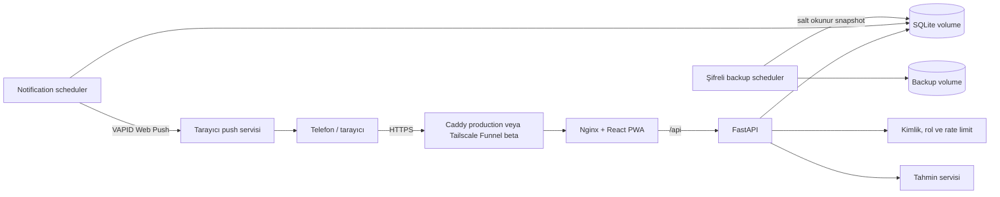

# Mimari ve ölçeklenebilirlik

## Amaç ve kapsam

Luna, tek deployment üzerinden davetli birden fazla kullanıcının kendi döngü verisini takip edebildiği, kendi kendine barındırılan bir PWA'dır. React PWA, FastAPI ve SQLite katmanlarından oluşur. Yönetici hesabı operasyon içindir; sağlık verilerine erişmez. Kişisel takip için ayrı `user` hesabı kullanılır.

Nginx statik frontend'i sunar ve API isteklerini backend container'ına yönlendirir. Kalıcı production katmanında Caddy TLS'i sonlandırır; domainsiz beta kullanımında Tailscale Funnel aynı HTTPS giriş rolünü üstlenir. İkisi aynı anda zorunlu değildir. Backend ve SQLite portları doğrudan internete açılmaz. Service Worker uygulama kabuğunu önbelleğe alır, Web Push olaylarını işler ve `/api` sağlık verilerini cache'lemez.

## Backend sorumlulukları

| Modül | Sorumluluk |
|---|---|
| `main.py` | FastAPI endpoint'leri, kayıt transaction'ı, kullanıcı/admin ve bildirim API işlemleri |
| `auth.py` | PBKDF2 parola, recovery/davet hash'leri, session ve rol dependency'leri |
| `rate_limit.py` | Hash'lenmiş IP+hesap kovalarıyla kalıcı auth deneme sınırları |
| `audit.py` | Allow-list kontrollü, sağlık verisi içermeyen admin hareket kayıtları |
| `database.py` | SQLite bağlantısı, foreign key ayarı ve migration başlangıcı |
| `migrations/` | Sıralı, transaction'lı şema yükseltmeleri ve hata halinde transaction rollback |
| `schemas.py` | Pydantic istek/yanıt sözleşmeleri |
| `services.py` | Model dönüşümü ve döngü tahmin algoritması |
| `notifications.py` | VAPID Web Push gönderimi, vadesi gelen hatırlatmalar ve teslim tekilleştirme |
| `notification_cli.py` | VAPID anahtarı üretimi, tek seferlik gönderim, scheduler ve sağlık kontrolü |
| `backup_cli.py` | SQLite online snapshot, AES-256-GCM şifreleme, doğrulama ve restore |
| `admin_cli.py` | İlk admin hesabının etkileşimli ve güvenli oluşturulması |

`main.py` ve doğrudan SQL yaklaşımı mevcut davetli MVP için işlevseldir; büyüyen ilk kod sınırlarıdır. Yeni domainler eklendiğinde `routers/auth.py`, `routers/admin.py`, `routers/periods.py`, `routers/notifications.py`, `repositories/` ve `services/` ayrımı yapılmalıdır.

## Frontend sorumlulukları

| Dosya | Sorumluluk |
|---|---|
| `App.tsx` | Auth/onboarding, kişisel dashboard, takvim, ayarlar, bildirim tercihleri ve admin paneli |
| `api.ts` | Cookie kullanan merkezi ve tipli HTTP istemcisi |
| `types.ts` | API sözleşmelerinin TypeScript karşılıkları |
| `styles.css` | Responsive görsel sistem |
| `public/sw.js` | PWA shell cache, çevrimdışı fallback, `push` ve `notificationclick` olayları |

`App.tsx` yeni büyük özelliklerden önce `features/auth`, `features/tracker`, `features/notifications`, `features/admin` ve ortak `components` parçalarına ayrılmalıdır.

## Veri modeli

### `accounts`

E-posta, parola hash/salt, recovery hash, `admin|user` rolü ve aktiflik durumu. Migration öncesindeki singleton hesap `user` rolünde ve aynı id ile korunur.

### `profile`

Bir kullanıcıya bire bir bağlıdır. Primary key olan `account_id`, `accounts.id` alanına foreign key'dir. İsim ve başlangıç ortalamalarını tutar.

### `periods`

Her satır `account_id` sahibine bağlıdır. Başlangıç/bitiş, akış, semptom JSON'u, not ve zaman damgalarını tutar. `UNIQUE(account_id, start_date)` sayesinde kullanıcı kendi içinde aynı başlangıcı iki kez kaydedemez; farklı kullanıcılar aynı tarihi kaydedebilir.

### `sessions`

Ham cookie değil SHA-256 token özeti, hesap ilişkisi ve sona erme zamanını tutar. Pasif hesap session sorgusundan dönmez.

### `invite_codes`

Ham kod yerine SHA-256 hash, oluşturan admin, son tarih, kullanım limiti/sayısı ve iptal zamanını tutar.

### `auth_rate_limit_events`

Düz e-posta veya IP yerine hash'lenmiş kova anahtarı, işlem türü ve zaman damgası tutar. Backend yeniden başlasa da auth deneme sınırları korunur.

### `admin_audit_logs`

Admin kimliği/e-posta snapshot'ı, action, hedef ve sınırlı JSON metadata tutar. Yönetim işlemiyle aynı transaction'a katılır. Sağlık tablolarından veri içermez.

### `notification_preferences`

Hesaba ait açık/kapalı durumu, yaklaşan regl için kaç gün önce uyarılacağı, PMS seçimi, yerel saat ve IANA saat dilimini tutar. Tercihler aynı hesabın cihazları arasında ortaktır.

### `push_subscriptions`

Her cihazın benzersiz Web Push endpoint'ini ve tarayıcının `p256dh`/`auth` anahtarlarını `account_id` ile ilişkilendirir. Bir hesabın birden fazla cihaz aboneliği olabilir; cihazdaki aboneliği kaldırmak diğer cihazları kapatmaz.

### `notification_deliveries`

`account_id + notification_type + target_date` primary key'iyle aynı PMS veya regl hatırlatmasının ikinci kez gönderilmesini engeller.

## Yetkilendirme ve izolasyon

1. Cookie token'ı hash'lenir ve aktif hesapla birlikte session tablosundan bulunur.
2. Endpoint rol dependency'si `user` veya `admin` gereksinimini uygular.
3. Tüm profil, dönem, tahmin, export, restore ve bildirim sorguları `account_id` ile filtrelenir.
4. Başka hesaba ait dönem id'si güncelleme/silmede bulunmuş kabul edilmez ve `404` döner.
5. Admin sorguları yalnızca hesap, davet ve audit metadata kolonlarını seçer; sağlık veya push abonelik tablolarına join yapmaz.

Kayıt sırasında davet doğrulama, hesap/profil/ilk dönem oluşturma, davet kullanım sayısını artırma ve session yazma tek `BEGIN IMMEDIATE` transaction içinde gerçekleşir.

## Tahmin algoritması

Başlangıçlar sıralanır; ardışık geçerli aralıkların (15–60 gün) ortalaması döngü uzunluğunu verir. Tamamlanmış kayıtlar regl süresi ortalamasını oluşturur. Yetersiz geçmişte profil varsayımları kullanılır. Sonraki regl, ovülasyon, doğurgan pencere ve 7 günlük PMS penceresi takvim tabanlı yaklaşık değerlerdir; tıbbi model veya doğum kontrol yöntemi değildir.

## Bildirim akışı

1. Kullanıcı kurulu PWA içinden sistem izni verir ve cihaz aboneliği FastAPI'ye kaydedilir.
2. `notifications` Compose profiliyle çalışan scheduler varsayılan olarak beş dakikada bir hesapların yerel saatini kontrol eder.
3. Tahmin servisi yaklaşan regl veya PMS başlangıcının vadesini belirler.
4. `pywebpush` hassas tarih, semptom, not veya e-posta içermeyen payload'ı tüm aktif cihaz aboneliklerine yollar.
5. Başarılı hatırlatma `notification_deliveries` tablosuna yazılır; 404/410 dönen süresi dolmuş abonelikler temizlenir.

## Ölçeklenebilirlik

| Alan | Mevcut durum | Sınır / geçiş |
|---|---|---|
| Arkadaş grubu / düşük trafik | Uygun | Tek SQLite writer bu ölçek için yeterli |
| Birden fazla cihaz | Uygun | Aynı HTTPS deployment'a bağlanır ve cihaz bazlı push aboneliği kullanır |
| Çok kullanıcı veri izolasyonu | Uygun | `account_id`, rol dependency'leri ve otomatik testler mevcut |
| Yüksek eşzamanlı yazma | Sınırlı | PostgreSQL'e geçiş gerekir |
| Birden fazla backend/scheduler instance | Sınırlı | PostgreSQL, merkezi session/queue ve dağıtık kilit gerekir |
| Tam offline yazma | Yok | Şifreli IndexedDB queue ve senkronizasyon tasarlanmalı |
| Public internet güvenliği | Kısmi | HTTPS, kalıcı auth rate limit ve audit mevcut; e-posta doğrulama, edge/merkezi limiter ve operasyonel izleme eksik |
| 7/24 hatırlatma | Yerel beta ile sınırlı | Bilgisayar, Docker ve Funnel açık kalmalı; kalıcı sunucuya geçiş gerekir |

SQLite tek sunucudaki küçük, davetli kullanım için bilinçli bir seçimdir. Genel erişimli veya yoğun kullanımlı bir ürüne geçişte PostgreSQL, SQLAlchemy/Alembic, merkezi session/queue, edge rate limiting, e-posta doğrulama ve izleme planlanmalıdır.

## Temiz kod değerlendirmesi

Güçlü taraflar: tipli API sözleşmeleri, parameterized SQL, transaction'lı migration, merkezi auth, rol ayrımı, veri sahipliği filtreleri, hassas verisiz audit kayıtları ve backend entegrasyon testleri. Bilinen teknik borçlar: büyüyen `main.py` ve `App.tsx`, merkezi hata kodları/yapılandırılmış loglama eksikliği, frontend component/e2e testlerinin olmaması ve çok instance koordinasyonunun bulunmaması.

Sonuç: mimari davetli küçük çok kullanıcılı tek-host deployment için düzenli ve yeterlidir; yüksek trafikli genel SaaS veya tam offline-first ürün olarak henüz ölçeklenmiş değildir.