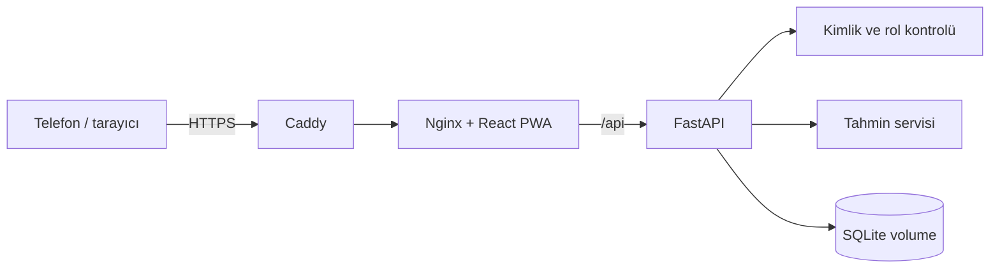

# Mimari ve ölçeklenebilirlik

## Amaç ve kapsam

Luna, tek deployment üzerinden davetli birden fazla kullanıcının kendi döngü verisini takip edebildiği, kendi kendine barındırılan bir PWA'dır. React PWA, FastAPI ve SQLite katmanlarından oluşur. Yönetici hesabı operasyon içindir; sağlık verilerine erişmez. Kişisel takip için ayrı `user` hesabı kullanılır.

Nginx statik frontend'i sunar ve API isteklerini backend container'ına yönlendirir. Production katmanında Caddy TLS'i sonlandırır. Backend portu doğrudan internete açılmaz. Service Worker uygulama kabuğunu önbelleğe alır; API sağlık verilerini cache'lemez.

## Backend sorumlulukları

| Modül | Sorumluluk |
|---|---|
| `main.py` | FastAPI endpoint'leri, kayıt transaction'ı, kullanıcı/admin işlemleri |
| `auth.py` | PBKDF2 parola, recovery/davet hash'leri, session ve rol dependency'leri |
| `database.py` | SQLite bağlantısı, foreign key ayarı ve migration başlangıcı |
| `migrations/` | Sıralı, transaction'lı ve geri alınabilir şema yükseltmeleri |
| `schemas.py` | Pydantic istek/yanıt sözleşmeleri |
| `services.py` | Model dönüşümü ve döngü tahmin algoritması |
| `admin_cli.py` | İlk admin hesabının etkileşimli ve güvenli oluşturulması |

`main.py` MVP için okunabilir durumdadır ancak büyümeye başlayan ilk sınırdır. Yeni domainler eklendiğinde `routers/auth.py`, `routers/admin.py`, `routers/periods.py`, `repositories/` ve `services/` ayrımı yapılmalıdır.

## Frontend sorumlulukları

| Dosya | Sorumluluk |
|---|---|
| `App.tsx` | Auth/onboarding, kişisel dashboard, takvim, ayarlar ve admin paneli |
| `api.ts` | Cookie kullanan merkezi HTTP istemcisi |
| `types.ts` | API sözleşmelerinin TypeScript karşılıkları |
| `styles.css` | Responsive görsel sistem |
| `public/sw.js` | PWA shell cache ve çevrimdışı fallback davranışı |

`App.tsx` yeni özelliklerden önce `features/auth`, `features/tracker`, `features/admin` ve ortak `components` parçalarına ayrılmalıdır.

## Veri modeli

### `accounts`

E-posta, parola hash/salt, recovery hash, `admin|user` rolü ve aktiflik durumu. Migration öncesindeki singleton hesap `user` rolünde ve aynı id ile korunur.

### `profile`

Bir kullanıcıya bire bir bağlıdır. Primary key olan `account_id`, `accounts.id` alanına foreign key'dir. İsim ve başlangıç ortalamalarını tutar.

### `periods`

Her satır `account_id` sahibine bağlıdır. Başlangıç/bitiş, akış, semptom JSON'u, not ve zaman damgalarını tutar. `UNIQUE(account_id, start_date)` sayesinde kullanıcı kendi içinde aynı başlangıcı iki kez kaydedemez; farklı kullanıcılar aynı tarihi kaydedebilir.

### `sessions`

Ham cookie değil SHA-256 token özeti, hesap ilişkisi ve sona erme zamanını tutar. Pasif hesap session sorgusundan dönmez.

### `invite_codes`

Ham kod yerine SHA-256 hash, oluşturan admin, son tarih, kullanım limiti/sayısı ve iptal zamanını tutar.

## Yetkilendirme ve izolasyon

1. Cookie token'ı hash'lenir ve aktif hesapla birlikte session tablosundan bulunur.
2. Endpoint rol dependency'si `user` veya `admin` gereksinimini uygular.
3. Tüm profil, dönem, tahmin, export ve restore SQL sorguları `account_id` ile filtrelenir.
4. Başka hesaba ait dönem id'si güncelleme/silmede bulunmuş kabul edilmez ve `404` döner.
5. Admin sorguları yalnızca hesap ve davet metadata kolonlarını seçer; sağlık tablolarına join yapmaz.

Kayıt sırasında davet doğrulama, hesap/profil/ilk dönem oluşturma, davet kullanım sayısını artırma ve session yazma tek `BEGIN IMMEDIATE` transaction içinde gerçekleşir.

## Tahmin algoritması

Başlangıçlar sıralanır; ardışık geçerli aralıkların (15–60 gün) ortalaması döngü uzunluğunu verir. Tamamlanmış kayıtlar regl süresi ortalamasını oluşturur. Yetersiz geçmişte profil varsayımları kullanılır. Sonraki regl, ovülasyon, doğurgan pencere ve 7 günlük PMS penceresi takvim tabanlı yaklaşık değerlerdir; tıbbi model veya doğum kontrol yöntemi değildir.

## Ölçeklenebilirlik

| Alan | Mevcut durum | Sınır / geçiş |
|---|---|---|
| Arkadaş grubu / düşük trafik | Uygun | Tek SQLite writer bu ölçek için yeterli |
| Birden fazla cihaz | Uygun | Aynı HTTPS deployment'a bağlanır |
| Çok kullanıcı veri izolasyonu | Uygun | `account_id`, rol dependency'leri ve otomatik testler mevcut |
| Yüksek eşzamanlı yazma | Sınırlı | PostgreSQL'e geçiş gerekir |
| Birden fazla backend instance | Sınırlı | PostgreSQL + merkezi session store gerekir |
| Tam offline yazma | Yok | IndexedDB queue/senkronizasyon tasarlanmalı |
| Public internet güvenliği | Kısmi | HTTPS var; rate limit, e-posta doğrulama ve izleme eklenmeli |

SQLite tek sunucudaki küçük, davetli kullanım için bilinçli bir seçimdir. Genel erişimli veya yoğun kullanımlı bir ürüne geçişte PostgreSQL, SQLAlchemy/Alembic, rate limiting, e-posta doğrulama, audit log ve merkezi session store planlanmalıdır.

## Temiz kod değerlendirmesi

Güçlü taraflar: tipli API sözleşmeleri, parameterized SQL, transaction'lı migration, merkezi auth, rol ayrımı, veri sahipliği filtreleri ve backend entegrasyon testleri. Bilinen teknik borçlar: büyüyen `main.py` ve `App.tsx`, merkezi hata kodlarının/loglamanın olmaması, UI component/e2e testlerinin ve rate limiting'in eksikliği.

Sonuç: mimari davetli küçük çok kullanıcılı deployment için düzenli ve yeterlidir; yüksek trafikli genel SaaS olarak henüz ölçeklenmiş değildir.
